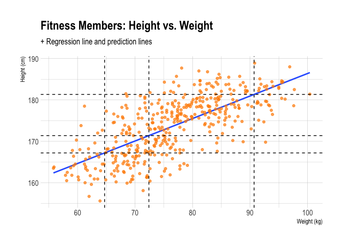
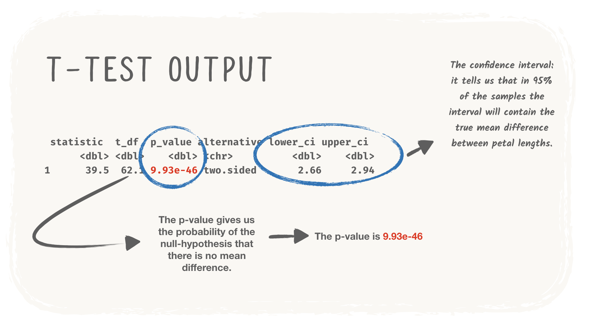
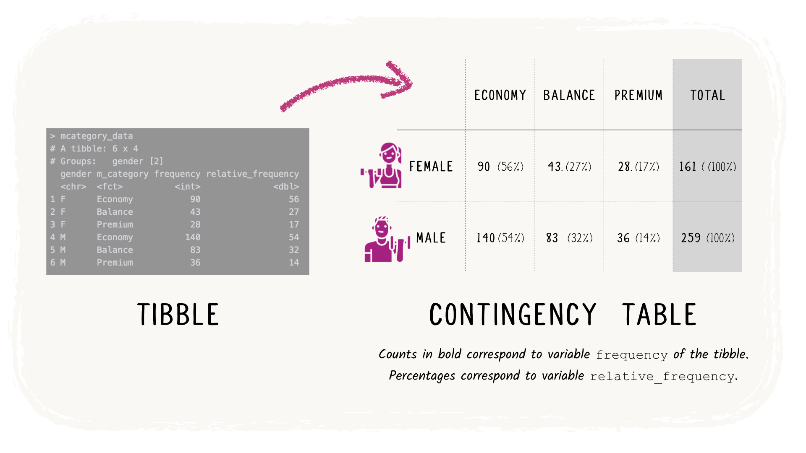

Libraries
```{r message=FALSE, warning=FALSE}
library(tibble)
library(ggplot2)
library(dplyr)
library(tidyr)
library(janitor)
library(purrr)
library(stringr)
library(visdat)
library(infer)
```

Dataset load
```{r}
salary_raw <- read.csv('Data/salary_data.csv')
fitness_members_raw <- read.csv('Project 3\\data\\fitness_members.csv', colClasses = c(id="character"))
fitness_tracking_raw <- read.csv('Project 3\\data\\fitness_tracking.csv', colClasses = c(id="character"))
fitness_members_missing_values <- read.csv('Data/fitness_members_missing_values.csv', colClasses = c(id="character"))%>%
  select(id, registration_date, gender, height, weight)
```

Quick presentation of the dataset:
```{r}
salary_raw
```
When describing our data, it most often makes sense to first visualize the data. I.e., we will have a look at how our data is distributed. We can then immediately get a general sense of what is going on in the data.

# Numerical data

Useful visualizations to examine the distribution of data are the boxplot and the histogram.
```{r}
ggplot(salary_raw, mapping = aes(x = city, y = salary)) +
  geom_boxplot()
```
```{r}
ggplot(salary_raw, mapping = aes(x = salary)) +
  geom_histogram() +
  facet_wrap(~ city)
```

For now, we leave the visualization part for what it is. However, more techniques on visualizing descriptive statistics will be discussed in the next unit.

## Mean
```{r}
salary_raw %>%
  summarise(mean_salary = mean(salary))
```
Can you change the following code such that it calculates not the overall mean salary, but the mean split by living in the capital or not?
```{r}
salary_raw %>%
  group_by(city) %>%
  summarise(mean_salary = mean(salary))
```
## Median
While the mean has to do with the middle value, the median is more about the middle position. To obtain the median of a dataset we must first sort the values in numerical order from smallest to largest. If we have an odd number of values then the median is the unique value which lies in the middle position of our sorted list. If we have an even number of values then the median is the mean of the two values which lie in the middle positions.
```{r}
salary_raw %>%
  summarise(median_salary = median(salary))
```
```{r}
salary_raw %>%
  group_by(city) %>%
  summarise(median_salary = median(salary))
```
## The mode
The mode is perhaps the most intuitive measure to understand: it is simply the value which occurs the most often in a dataset. An easy way to remember the mode is using the acronym Most-often Occurring Data Element.

What if there is more than one value that appears the most often? In that case we consider each value that occurs the most often as the mode.

The mode is the trickiest value to obtain in R, as there is no function for it to do so. To obtain the mode, we would have to count() how often each value occurs, and then take the value, or values, that occur(s) the most.
```{r}
salary_raw %>%
  count(salary, sort = TRUE) %>%
  filter(n == max(n))
```
```{r}
salary_raw %>%
  group_by(city) %>%
  count(salary, sort = TRUE) %>%
  filter(n == max(n))
```
Now you might wonder why we would want to have multiple ways of computing an average value. After all why can't we just pick one and stick with it? As it turns out, they each have distinct properties that makes them appropriate for different scenarios. Let's look again at our example.

Did you notice that the mean and the median salaries are very different from each other? Look at the following histogram, where the mean and median are highlighted :
```{r}
ggplot(salary_raw, mapping = aes(x = salary)) +
  geom_histogram() +
  geom_vline(data = salary_raw %>%
               summarize(mean = mean(salary), median = median(salary)) %>%
               gather(stat, value, mean, median),
             mapping = aes(xintercept = value, colour = stat))
```
The mean lies much higher than the median. This is often the case when looking at salary data: because there are a few people that are earning much higher salaries than most people, the mean will be shifted to the right (it will be higher). You could argue that looking at the median in a case like this provides a better representation of the central tendency of the data than the mean.

# Categorical data
Earlier, we established that living in the capital is a nominal column, and that we cannot compute statistics such as the mean on such a column.

There are however two other ways in which we can describe ordinal and nominal data. The first one is frequency counts, which will reveal to us how many observations we have on each category.

Getting frequency tables in R is simple:
```{r}
salary_raw %>%
  count(city)
```
If this code looks familiar, this makes sense, because we used a very similar approach to calculate the mode for the salaries. Remember that the mode simply counts which value appears the most often in the data?

This means that we can use this statistic also for nominal and ordinal data. Simply put, the mode of a categorical column is the category that appears most often. Can you write code that reveals to us which category is the mode in this data?

# Descriptive statistics

## Spread
For this, the most straightforward measures to consider are the minimum, maximum, and range of the data. Knowing the minimum and maximum of the data is useful because it can help you determine whether all the values in your data are actually possible.

The range, further, is simply the distance between the minimum value of the data, and the maximum value of the data.

Can you calculate the minimum, maximum, and range of salary, and give the output in a tibble?
```{r}
salary_raw %>%
  summarise(min_salary = min(salary),
            max_salary = max(salary),
            range_salary = max_salary - min_salary)
```
## Quartiles and interquartile range
In R, we can obtain the quartiles using the `quantile()` function. Have a look at the following code:
```{r}
salary_raw %>%
  summarise(q1 = quantile(salary, 0.25),
            q2 = quantile(salary, 0.5),
            q3 = quantile(salary, 0.75))
```
Before reading on, can you describe in your own words what the quantile() function does?

Say we want to split the data according to the first quartile. Recall that the first quartile splits the data at 25%, so that the lowest 25% of observations are split from the highest 75%. The quantile() function finds for the specified percentage point, in this case .25, the value in the data for which this happens. We find that in the salary data, a salary of 40'000 EXF lies on Q1.

There are two things to note.

* For statistical reasons, the split is expressed as a probability. So instead of saying 25, we type 0.25.
* Note that the function is called quantiles, not quartiles. This is because the function is not limited to the quartiles, but it can split the data by any value.

## The variance

As before, you don't ever have to calculate variance and standard deviation by hand. Instead we can use R's built-in functions:
```{r}
salary_raw %>%
  group_by(city) %>%
  summarise(variance_salary = var(salary),
            sd_salary = sd(salary))
```
# Select the right graph!

## Graph for 1 variable

### Graph for 1 numerical continuous variable

Question : What is the distribution of member weights at week 0, when they register to the Fitness Club ?

Recommendation 1 : Do a Histogram
```{r}
fitness_members_raw %>% ggplot(aes(x = weight)) +
  geom_histogram(aes(y = after_stat(density)),
                 bins = 20,
                 colour = "black",
                 fill = "purple",
                 alpha = 0.3) +
  geom_density() +
  labs(title = "Weight at week 0",
       caption = "Fitness Club The Good Fit",
       x = "Weight (kg)",
       y = "Relative Frequency") +
  theme_minimal() 
```
<blockquote>
Regarding the number of bins, it is recommended to take bins ≈√n, i.e. the square root of n, where n is the number of observations. We selected bins = 20 because it is the closest integer to √420

  ```
  Maths reminder: √9=3
  because 3×3=9
  ```
  
R reminder: In R base, we can compute the square root of a number with the sqrt() function.
</blockquote>

<blockquote>
When you make a histogram, we recommend that you add a density curve using the geom_density() function (see Plotting distributions in the Data Visualisation subject).
</blockquote>

Recommendation 2 : Do a Boxplot
```{r}
fitness_members_raw %>% ggplot(aes(x = "", y = weight)) +
  geom_point(size = 5, alpha = 0.05, col = "purple") +
  geom_boxplot(alpha = 0.1, fill = "purple") +
  labs(title = "Weight at week 0",
       caption = "Fitness Club The Good Fit",
       x = "All members",
       y = "Weight (kg)") +
  coord_flip() +
  theme_minimal()
```
<blockquote>
When you produce a boxplot, we recommend that you plot as well the related data as shown in the figure above. This can be easily done using a geom_point() layer in addition to the geom_boxplot()layer (see corresponding code).
</blockquote>

## One non-continuous variable (i.e. categorical or discrete)

Question : Is there a big difference between the number of members in the Premium category compared to the other categories Economic and Balance ?

Recommendation 1 : Do a Barplot
```{r}
mcategory_data <- fitness_members_raw %>%
  count(m_category, name = "frequency")

mcategory_data %>% ggplot(aes(x = m_category, y = frequency, fill = m_category)) +
  geom_col(alpha = 0.7) +
  labs(title = "Membership categories",
       caption = "Fitness Club The Good Fit",
       x = "Membership category",
       y = "Frequency") +
  theme_minimal() +
  theme(legend.position = "none")
```
Recommendation 2 : Do a Pie Chart
```{r}
mcategory_data <- fitness_members_raw %>%
  count(m_category, name = "frequency") %>%
  mutate(relative_frequency = round(100*frequency/sum(frequency)))

mcategory_data %>% ggplot(aes(x = "", y = frequency, fill = m_category)) +
  geom_col(alpha = 0.7) +
  coord_polar("y", start = 0, direction = -1) +
  geom_text(aes(label = paste0(relative_frequency, "%")),
            position = position_stack(vjust = 0.5),
            size = 7) +
  labs(title = "Membership categories",
       subtitle = "Fitness Club The Good Fit",
       fill = "Membership category") +
  theme_void()
```
Surprisingly, the pie chart is an extremely popular tool to visualise relative frequencies of category levels. Between a barplot and a pie chart, we prefer the first option because it is much easier to compare bar heights than angles of pie slices.

## Graph for 2 variables

### Continuous vs. Continuous
Question : Can we observe a strong relationship between weight and height ?
Recommendation : Do a Scatterplot

```{r}
fitness_members_raw %>% ggplot(aes(x = height, y = weight)) +
  geom_point(colour = "purple",
             size = 4,
             alpha = 0.5) +
  labs(title = "Weight vs. Height at week 0",
       caption = "Fitness Club The Good Fit",
       x = "Height (cm)",
       y = "Weight (kg)") +
  theme_minimal()
```
Question : Can we visualise for any specific member the evolution of weight through the first 12 weeks ?
Recommendation : Do a Lineplot

```{r}
# Only get wk_000
week_one_tibble <- fitness_members_raw %>%
  mutate(wk_000 = weight) %>%
  select(id,height,wk_000)

colnames_fitness_tracker <- colnames(fitness_tracking_raw)
# Let's just remove the id column from this vector
colnames_fitness_tracker <- colnames_fitness_tracker[!colnames_fitness_tracker == 'id']
colnames_fitness_tracker <- append(colnames_fitness_tracker, 'wk_000')

# List of dfs to join them
list_df <- list(week_one_tibble, fitness_tracking_raw)

# Join both tibbles
fitness_tracking_with_wk_000 <- list_df %>%
  reduce(left_join, by='id')

# Now we can pivot longer
fitness_tracking_long <- fitness_tracking_with_wk_000 %>%
  pivot_longer(cols = all_of(colnames_fitness_tracker), names_to = "week_nb", values_to = "weight") %>%
  drop_na() %>%
  # We also need to create a new column with the week numbers as numeric, but we will also keep week_id
  rename(week_id = week_nb) %>%
  mutate(week_nb = as.numeric(str_remove(week_id, "wk_")))

fitness_tracking_long %>%
  head()

```

```{r}
fitness_tracking_long %>%
  filter(id %in% c("000001", "000002", "000003", "000004"),
         week_nb <= 12) %>%
  ggplot(aes(x = week_nb, y = weight, colour = id)) +
  geom_point() +
  geom_line() +
  labs(title = "Weight vs. Week",
       caption = "Fitness Club The Good Fit",
       x = "Week",
       y = "Weight (kg)",
       colour = "Member id") +
  scale_x_continuous(breaks = 0:12) +
  theme_minimal()
```
<blockquote>
Lineplots are particularly useful when the x-axis variable is time related. It is the case in our example where the x-axis variable is the number of weeks after registration to the Fitness Club.
</blockquote>

Note that the above script uses the fitness_tracking_long tibble as input. This tibble was obtained from the fitness_tracking tibble which has a wide format (see unit What is data analysis). To show the evolution of the first 4 Fitness Club members over the first 12 weeks, we use the filter() function.

### Continuous vs. Non-continuous
Question : At week 0, corresponding to registration to the Fitness Club, how different is the distribution of weights for female fitness members compared to male fitness members ?

Recommendation 1 : Do a Histogram by Gender
```{r}
fitness_members_raw %>% ggplot(aes(x = weight)) +
  geom_histogram(aes(y = ..density..),
                 bins = 14,
                 colour = "black",
                 fill = "purple",
                 alpha = .3) +
  geom_density() +
  labs(title = "Weight at week 0 by Gender",
       caption = "Fitness Club The Good Fit",
       x = "Weight (kg)",
       y = "Relative Frequency") +
  facet_wrap(vars(gender), ncol = 1) +
  theme_minimal()
```
Recommendation 2 : Do a Boxplot by Gender
```{r}
fitness_members_raw %>% ggplot(aes(x = gender, y = weight)) +
  geom_point(size = 5, alpha = 0.05, col = "purple") +
  geom_boxplot(alpha = 0.1, fill = "purple") +
  labs(title = "Weight at week 0",
       caption = "Fitness Club The Good Fit",
       x = "Gender",
       y = "Weight (kg)") +
  coord_flip() +
  theme_minimal()
```
## Non-continuous vs. Non-continuous
Question : When we compare the number of members in the Premium category to the other categories Economic and Balance, do we observe a similar pattern for female and male fitness members ?

Recommendation 1 : Do a Barplot by Gender

```{r}
mcategory_data <- fitness_members_raw %>%
  count(m_category, gender, name = "frequency")

mcategory_data %>% ggplot(aes(x = m_category, y = frequency, fill = m_category)) +
  geom_col(alpha = 0.7) +
  labs(title = "Membership categories by Gender",
       caption = "Fitness Club The Good Fit",
       x = "Membership category",
       y = "Frequency") +
  facet_wrap(vars(gender), ncol = 1) +
  theme_minimal() +
  theme(legend.position = "none") 
```

Recommendation 2 : Do a Heatmap
```{r}
mcategory_data <- fitness_members_raw %>%
  count(gender, m_category, name = "frequency") %>%
  group_by(gender) %>%
  mutate(relative_frequency = round(100*frequency/sum(frequency)))

mcategory_data %>% ggplot(aes(x = m_category, y = gender)) +
  geom_tile(aes(fill = relative_frequency)) +
  scale_fill_gradient(low = "white", high = "steelblue") +
  labs(title = "Membership categories by Gender",
       subtitle = "Fitness Club The Good Fit",
       x = "Membership category",
       y = "Gender",
       fill = "% by Gender")
```
Note that the input to produce the above heatmap is the mcategory_data tibble which is derived from the fitness_members tibble using the count() function. The heatmap is actually a visualisation of the resulting tibble detailed here below.
```{r}
mcategory_data
```
From the heatmap, you can already see that the distribution of membership categories is very similar for both male and female fitness members.

##What did your learn in this unit ?

[✓] To make sure that you have a specific question to answer before you plot the data !

[✓] To produce the recommended graphs when there is one variable to analyse, either Continuous or Non-continuous.

[✓] To produce the recommended graphs when there are two variables to analyse, for all possible combinations: Continuous vs. Continuous, Continuous vs. Non-continuous, and Non-continuous vs. Non-continuous.

# Dealing with missing values

Let’s begin by a simple exercise to count the number of NA values in a column. We can see in the preview above that the first two rows contain NA values for the weight column. But it’s quite possible that there are more than just these two NA values in all 420 rows.

One way to check whether a data set contains NA values is to use the {visdat} package that we learned about earlier in the course.
```{r}
vis_dat(fitness_members_missing_values)
```
Immediately, we know that the data contains NA values, since the {visdat} chart shows NA in the legend, and the registration_date and weight columns show horizontal grey lines in them.
{visdat} will give us an even more detailed overview of the missing values via the vis_miss() function.

```{r}
visdat::vis_miss(fitness_members_missing_values)
```
We can also count the total number of NA values in the weight column using the simple technique below:
```{r}
fitness_members_missing_values %>%
  summarise(count = sum(is.na(weight)))
```
From the result above, we can see that there are 6 NA values in the weight column. While we could simply omit these rows from the cleaned data set, doing so would mean that we’re omitting valueable data contained in all of the other columns next to the NA value. A better idea is to replace the NA with a relatively neutral statistic. We recommend using the median as a default, but if you think it makes sense for your data you may choose to use the average or even the mode.
## Imputing NA with the median
Using the median will avoid the influence of outlier data on the substitute value. Outliers are another example of values that we might wish to replace in our data set, but for now let’s impute the NA values for weight with the median of all non NA values in the weight column.

The code below uses the replace() function, which takes three arguments. replace(x, list, values) will replace the values in a vector (x) at specific indices (list) with new values (values). In this way, we’re mutating weight below with a copy of itself where the missing values have been imputed.

```{r}
fitness_members_missing_values %>%
  mutate(weight = replace(weight, is.na(weight), median(weight, na.rm = TRUE)))
```
You may be wondering which value is more representative of the missing data in a numeric column; the median or the mean. While to some extent this will vary depending on the distribution of the data in question, there’s another technique that we can use that will make our imputations even more reflective of the other values in the data set.
All it takes is a little critical thinking, and a single line of code.
```{r}
weight_corrected <- fitness_members_missing_values %>%
  group_by(gender) %>%
  mutate(weight = replace(weight, is.na(weight), median(weight, na.rm = TRUE))) %>%
  ungroup()

weight_corrected
```
In the example above, we grouped the data by gender before we calculated the median. Doing this makes the imputed values much more meaningful when we consider that, generally speaking, men weigh more than women. Now the median value is 69.6 for women, and 81.3 for men, rather than both being 76.1.

We can now also see that the number of NA values in the weight column has been reduced to zero:
```{r}
weight_corrected %>%
  summarise(count = sum(is.na(weight)))
```
## Imputing non-standard NA values
You may have noticed by now that the height column doesn’t have the same class as the weight column. When we encounter situations like this, the right thing to do is to ask ourselves why that might be the case. Since letters will appear before numbers when we arrange a character column by ascending order, we can easily see whether the column contains any non-numeric values:
```{r}
weight_corrected %>%
  arrange(height)
```
We can now see that height contains values for “N/A”, “na”, and “NA”. Each of these represents missing data, but before we can impute the median, we’ll need to convert the column to the dbl class, and these missing values to NA. The as.numeric() function will take care of that for us.
```{r}
weight_corrected <- weight_corrected %>%
  mutate(height = as.numeric(height))
```
```{r}
weight_corrected %>%
  filter(is.na(height)) # Filter for just the NA height values
```
Our data can now be used to calculate a relevant statistic that we can impute the missing height values with.

Imputing with the median is uncomplicated, but it is far from the most sophisticated statistic that we can use. One way to calculate a more meaningful substitute value would be to determine the relationship between two variables (correlation), and to use this correlation to calculate the missing value.

For example; we know that there is typically a strong correlation between weight and height for human beings. We can perform a regression analysis on our fitness_members data to determine this correlation from the data in the table. Below is a visualization of the correlation between height and weight for the fitness members.

We could use this correlation to predict the missing height values from their corresponding weight values. Generally speaking, this method will produce a more accurate substite value than the median. Visually, we could draw a vertical line from each of the known weight values, and the point on which the lines cross the regression line would correspond to the predicted height value.

Below we can see the points at which the dashed lines above correspond to the following predicted_height and actual_weight values:

```
A tibble: 3 x 2
       actual_weight predicted_height
          <dbl>            <dbl>
1          90.7             181.
2          72.4             171.
3          64.7             167.
```
Using regression analysis is a concept that we’ll explore in greater detail very soon. In the meantime, just remember that there are different methods that we can use to predict missing values, and that regression analysis can be a good option for situations where there is a strong correlation between two variables.

## Last observation carry forward & next observation carry backward
Sometimes we encounter data that contains missing values simply due to a formatting error. The classic example of this is when someone exports a formatted spreadsheet where some of the cells have been merged to make the spreadsheet more presentable. We can see an example of this below, where the deal_size column contains values that span across multiple rows.
It’s quite possible that when the table above gets exported from Excel and imported in R-Studio.

Let’s demonstrate NOCB on our fitness memberships data. There are two NA values in the registration_date column that we can see if filter registration_date for NA:
```{r}
weight_corrected %>%
  filter(registration_date=="")
```
In the block below, we’ll impute the two missing values with the next-appearing values in the registration_date column by setting the .direction argument for fill().
```{r}
cleaned_memberships <- weight_corrected %>%
  mutate(registration_date = as.Date(registration_date, format="%Y-%m-%d")) %>%
  mutate(id = as.numeric(id)) %>% # convert id from character to numeric
  fill(registration_date, .direction = "up")
```
Above we can see imputed registration dates: 2019-01-19 (id: 282) and 2019-02-01 (id: 288). As was the case with imputing the median for the weight column NAs, here too it is important to think critically about which value to use for the substitution. These values are never meant to be considered the actual missing value; still, it’s our job as data scientists to think critically about the most sensible choice of substitute value for each particular situation.

In this unit, we explored several different methods of imputation —the practice of replacing missing values with relevant substitutes. We also briefly introduced the topic of regression, which will be expanded on later in this subject.

#Correlations in R
Below we will use the cars dataset and explore the relationship between speed and stopping distance of cars, and ultimately calculate the correlation.

The cars dataset is a dataset that comes with R. As such, there is no need to import anything, the dataset exists under the variable name cars in R already.

Let's first have a look at the first few rows of the data, to see what we are dealing with.
```{r}
head(cars)
```
Generally, before doing any statistical analysis, such as in this case calculating a correlation, it is useful to first visualize the data. This helps us to get a feel of whether any patterns exist in the data, and, perhaps more importantly, it is a good way to immediately identify if anything is wrong with the data.

```{r}
cars %>%
  ggplot(aes(x = speed, y = dist)) +
  geom_point()
```
We can see from the resulting plot already that there is a strong, positive relationship between speed and dist. If speed is higher, dist is higher too.

Now let's calculate the correlation. For this, we can use the cor() function which is available by default by R.

```{r}
cars %>%
  select(speed, dist) %>%
  cor()
```
Ok, we asked for a correlation, but we get four values in return. What do these results mean?

We can see indeed that R returns to us four values, organised in what we call a correlation matrix or correlation table. Why does it give us a table and not just a simple correlation? This is because if we give cor() a tibble with columns, R will calculate for us all possible correlations on that tibble and organise those for us in a table.

So, we don't only get the correlation between speed and distance, but also the correlation between distance and speed. These are of course the same (remember that correlation is not causation, so the relationship looks the same in both directions) and we can confirm this by looking at the table.

In addition, we get the correlations between speed and speed, and distance and distance. These are not very interesting to look at. If we correlate a variable with itself, they will be perfectly correlated, which means they will have a correlation of 1.

At this point, when we're looking at only two variables, getting a table with all possible correlations is not very useful. This changes when we are interested in more variables however. We will look at this in a minute.

There is a relation between speed and distance. For cases with a higher speed, we observe a larger distance as well. The correlation of .80, which is much closer to 1 than it is to 0, shows that this is quite a strong relationship as well.

## Correlation Matrices

In the previous section, we saw that by default cor() returns to us a correlation matrix, or correlation table. For two variables this is not so useful, but if you have many variables, this is a convenient way of quickly checking if any relationships exist in your data.

To illustrate, let's use another standard dataset that is available in R: the iris dataset. The iris dataset contains measurements in centimeters of four different attributes of three species of iris flowers: sepal length and width and petal length and width.

Let's ask for the correlations on the complete iris dataset. 

It turns out that one of the columns in iris is not suitable for correlation analysis, i.e. it is not numeric.

    This is a good reminder that we need to think about what data we put into our statistical analysis!

So let's try this again, and this time first have a look at what is actually in the dataset.
```{r}
iris %>%
  glimpse()
```
We can see that there are four numerical columns in our dataset (as indicated by <dbl>), and one categorical column (as indicated by <fct>), which is the variable Species. For now, we will only focus on the numerical columns.

Let's now ask for the correlations on the numerical columns in this dataset:
```{r}
iris %>%
  select(-Species) %>%
  cor()
```
We can see from the output, pictured below, that asking for the correlation matrix gives us a nice overview of all correlations in your dataset.

Can you interpret for each correlation what it means for the relationship between these two variables?

What did your learn in this unit ?

[✓] A reminder that to inspect the relationship between two numerical variables, it is useful to create a scatterplot.

[✓] How to interpret a correlation

[✓] That correlation is not causation

[✓] How to compute correlation and a correlation matrix in R

# Exploring and inferring relationships between variables: Group differences
From the iris dataset, create a new tibble called iris_filtered that only contains the two species of interest: Iris setosa and Iris versicolor. Then, print the first six rows of this data to see what is inside it.
```{r}
iris_filtered <- iris %>% filter(Species != "virginica")
head(iris_filtered)
```
Can you compute some descriptive statistics that would give us an impression of differences in Petal.Length by Species?
```{r}
iris_filtered %>%
  group_by(Species) %>%
  summarise(mean_length = mean(Petal.Length),
            sd_length = sd(Petal.Length),
            min_length = min(Petal.Length),
            max_length = max(Petal.Length))
```
Can you create a boxplot that gives some further insight into any group differences on Petal.Length by Species?
```{r}
iris_filtered %>%
  ggplot(mapping = aes(x = Species, y = Petal.Length)) +
  geom_boxplot()
```
Normal distribution of the data:
```{r}
iris_filtered %>%
  ggplot(mapping = aes(x = Petal.Length, fill = Species)) +
  geom_histogram()
```

We can see that petal length is roughly normally distributed in both groups (i.e. it has the famous "bell" shape).

## The infer::t_test() function

With the assumptions partially met we can run the t-test, using the t_test() function from the {infer} package in R. If we type the following:
```{r}
iris_filtered %>% 
  t_test(Petal.Length ~ Species,
         order = c("versicolor", "setosa"))
```
But wait, before we start interpreting this output, remember that we violated the assumption of equal variances!

As we discussed, there is a remedy for that! t_test() has an additional argument that can be supplied to the function called var.equal. Try running the same code as before, but now with this argument added and set to FALSE, as specified in the code chunk below. This will ensure that the t-test is conducted such that it is robust to the violation of equal variances.
```{r}
iris_filtered %>% 
  t_test(Petal.Length ~ Species,
         order = c("versicolor", "setosa"),
         var.equal = FALSE)
```

Have a look at the output of this adjusted code. How does it compare with the previous output?

You might notice that the output of the adjusted code is exactly the same as the previous output. Why is this?

It turns out that the default value to the var.equal argument is already set to FALSE. So, while you were running the first code, R was already running a t-test that was robust to unequal variances.

Why would R by default run a t-test that is robust against assumption violation?

Because violation of assumptions is something that happens more often than not. If there is an obvious fix, that applies to the majority of cases, you will find that R might just use it as a default setting!

Now, let's go back to the results, which we've repeated on the image below. If everything went right, you will have seen from the descriptive statistics and the boxplots that Setosa plants seem to have smaller petal lengths than Versicolor plants. We did the t-test because we wanted to know if this result was statistically significant.


Looking at the results we have obtained, at a significance level of .05, do you think we can reject the null-hypothesis that the two species have the same petal lengths?

##What did you learn in this unit?

[✓] How to examine differences between groups on a continuous variable using descriptive statistics and data visualisation.
[✓] What the assumptions of a t-test are.
[✓] How to run a t-test in R. 

#Exploring and inferring relationships between variables: Contingency tables
To get a preliminary insight, we built the tibble mcategory_data as follows:
```{r}
mcategory_data <- fitness_members_raw %>%
  count(m_category, gender, name = "frequency")

mcategory_data
```
The resulting tibble is displayed here below. The table on the right, shows the same information presented in a different way:

In the descriptive statistics unit, we discussed how frequency tables can be useful to describe categorical data. Now, if we have two categorical variables, we can calculate the frequencies for one categorical variable by the categories of a second categorical variable. We call such a table a contingency table.

In the above figure we added a TOTAL column by gender because the question focuses on the distribution of membership categories by gender.

Such tables can be very helpful in inspecting whether two categorical variables are related. Another way to formulate the initial question of the example is:

Are the two categorical variables Fitness Membership Category and Gender related ?



If they are, you would expect the distribution of counts across the categories of Fitness Membership Category to be different for each category of Gender.

Contingency tables are helpful for this. What is even more useful is to look at the percentage tables, because these tables can give us an immediate insight in how the distributions are irrespective of the total number of observations.

If you want to visualise such a relationship, we can use grouped bar charts.

Can you plot a grouped bar chart to visualise the data of the above mentioned example ?

```{r}
mcategory_data %>% ggplot(aes(x = m_category, y = frequency, fill = m_category)) +
  geom_col(alpha = 0.7) +
  labs(title = "Membership categories by Gender",
       caption = "Fitness Club The Good Fit",
       x = "Membership category",
       y = "Frequency") +
  facet_wrap(vars(gender), ncol = 1) +
  theme_minimal() +
  theme(legend.position = "none")
```
# Linear Regression
To understand the principle of linear regression analysis, we will use a built in dataset from R called cars. It consists of 50 observations (rows) and 2 variables (columns): speed in mph and stopping distance in ft. Let's take a look at the top rows:
```{r}
head(cars)
```
To perform a linear regression analysis, we need at least two variables: one independent variable, the input, and one dependent variable, the target or the output. The goal is to assess how well the independent variable (here the speed) can explain the dependent variable (here the stopping distance). We will see with the cars data how we fit the best regression line using R.

In simple linear regression, there is only one independent variable usually named x

* The dependent variable is usually named y

* The simple linear regression assumes that there is a linear relationship between the two variables.

In our example, we will see if the following linear model is applicable to the cars data:

y=ax+b

where x
is the speed, and y the stopping distance; a and b

are the unknown coefficients to be computed in order to best fit the data.

What does it actually mean to "best fit the data" ?

If we represent the data in a scatterplot like in the picture below, the goal is to find out the closest line to the 50 points of the cars dataset.

```{r}
cars %>% ggplot(aes(x = speed, y = dist)) +
  geom_point(size = 4,
             colour = "darkorange",
             alpha = 0.7) +
  xlim(0, 25) +
  ylim(0, 120) +
  labs(title = "Stopping distance vs. Speed",
       x = "Speed (mph)",
       y = "Stopping distance (ft)") +
  theme_minimal()
```
To get the best fitting line through the cars data points, we can use the lm() function which is available by default in your R environment (i.e. you don't need to load a package to be able to use this function). The name of the function, lm, stands for linear model and we use it as follows:
```{r}
cars_fit <- lm(dist ~ speed, data = cars)
```
All the elements of the linear model are stored in the R variable cars_fit. One of those elements is the set of coefficients a and b

corresponding to the regression line. We obtain the set of coefficients by typing:
```{r}
coef(cars_fit)
```

The first value -17.579095 corresponds to the b coefficient of the model, also called the intercept of the regression line (it is actually the y value where the regression line crosses the vertical axis). The second value 3.932409 corresponds to the a coefficient of the model, also called the slope of the regression line.

How can you easily include a regression line in the above scatterplot ?

There is a useful function in the {ggplot2} package you can use for that: geom_smooth.

This is the resulting graph you get with the above code. Note that the geom_smooth function uses lm as smoothing method; the formula to specify the model has the same syntax y ~ x that we used to build the cars_fit model.
```{r}
cars %>% ggplot(aes(x = speed, y = dist)) +
  geom_smooth(method='lm', formula = y ~ x, se = FALSE) +
  geom_point(size = 4,
             colour = "darkorange",
             alpha = 0.7) +
  xlim(0, 25) +
  ylim(0, 120) +
  labs(title = "Stopping distance vs. Speed",
       subtitle = "+ Regression line",
       x = "Speed (mph)",
       y = "Stopping distance (ft)") +
  theme_minimal()
```


    Based on the coefficients we obtained, don't you think we could improve the model ?

The negative intercept b = -17.579095 means that when speed is 0 mph, we have a stopping distance of about -17.6 ft. That is rather unrealistic, don't you think ? One way to avoid this result would be to force the regression line to have a zero intercept value. You can do that in R as follows:
```{r}
cars_fit_wo_intercept <- lm(dist ~ -1 + speed, data = cars)
coef(cars_fit_wo_intercept)
```
To include the new regression line in the scatterplot, we use again the geom_smooth function by slightly modifying the model:
```{r}
cars %>% ggplot(aes(x = speed, y = dist)) +
  geom_smooth(method='lm', formula = y ~ -1 + x, se = FALSE) +
  geom_point(size = 4,
             colour = "darkorange",
             alpha = 0.7) +
  xlim(0, 25) +
  ylim(0, 120) +
  labs(title = "Stopping distance vs. Speed",
       subtitle = "+ Regression line",
       x = "Speed (mph)",
       y = "Stopping distance (ft)") +
  theme_minimal()
```
This is the best regression line with zero intercept, the one which best fits the cars data. If you still have some memories of your high school physics class, you may remember that the stopping distance should actually be a function of the square of speed. Theoretically, the model to fit to the cars data should then be the following one:

y=ax2

where x
is the speed, and y the stopping distance. There is only one coefficient to compute in this linear model, the slope a. It might be surprising that after having introduced the square of speed, we still talk about a linear model. A way to get convinced that we still have a linear model is to define the variable z=x2

. We can then express the model as follows:

y=az

where z
is the square of speed, and y the stopping distance. This model is clearly linear, with slope a and with a zero-intercept. How can we compute the slope a

in this case ? With the following code:
```{r}
cars_fit2 <- lm(dist ~ -1 + I(speed^2), data = cars)
coef(cars_fit2)
```
Note that the model is defined by dist ~ -1 + I(speed^2). Why is the I() function required here ? Without this function, the square of speed would not be computed because the ^2 operator has another meaning when we handle models in R. To include the new regression curve in the scatterplot, we use again the geom_smooth function by adjusting the model accordingly:
```{r}
cars %>% ggplot(aes(x = speed, y = dist)) +
  geom_smooth(method='lm', formula = y ~ -1 + I(x^2), se = FALSE) +
  geom_point(size = 4,
             colour = "darkorange",
             alpha = 0.7) +
  xlim(0, 25) +
  ylim(0, 120) +
  labs(title = "Stopping distance vs. Speed",
       subtitle = "+ Quadratic curve",
       x = "Speed (mph)",
       y = "Stopping distance (ft)") +
  theme_minimal()
```
Remember, the fitting curve linking x and y is obviously quadratic but the model y=ax2 is linear !
If you compare the graphs of the last and the first linear regression, don't you agree that there was a significant improvement ? This is an example of model improvement.

The comparison between the first and the last graph is obviously subjective. We can use advanced statistical tools to perform an objective comparison of models. We will not present those methods here because they are rather technical and beyond the scope of this course.

Moreover, we would like to stress out that model selection does not only involve statistical techniques. It also requires some external knowledge about the data and its context, like in the example presented in this unit.

##What did you learn in this unit ?

[✓] To fit a linear regression in R, and to draw the corresponding regression curve

[✓] To modify the linear model by removing or adding terms

[✓] To fit a quadratic curve in a scatterplot… using a linear regression model
